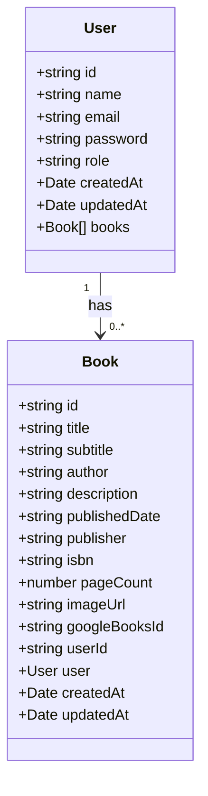
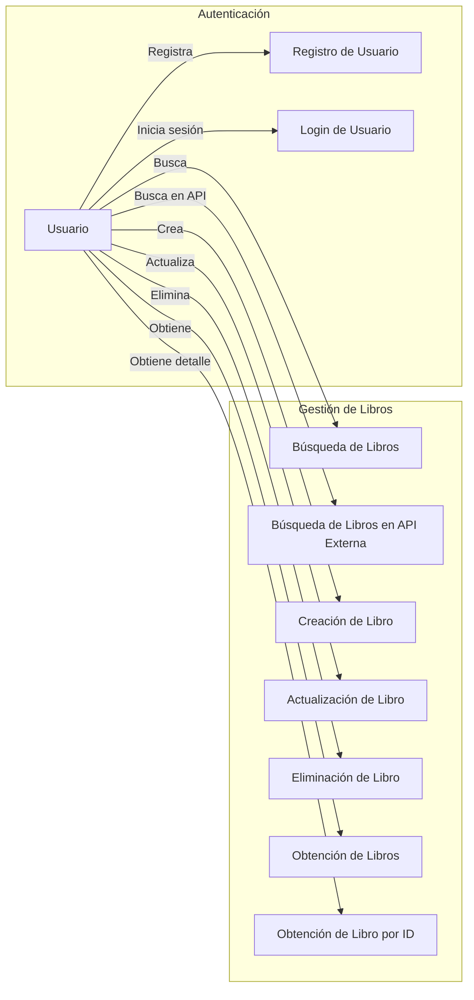
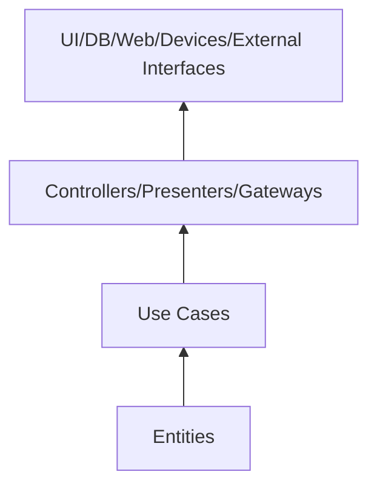

# Sistema de Gestión de Libros - Demo de Arquitectura Limpia

Este proyecto es una demostración técnica de arquitectura limpia (Clean Architecture) aplicada a una API REST de gestión de libros utilizando Node.js, TypeScript, Express y PostgreSQL con TypeORM.

## Características

- Arquitectura limpia (Clean Architecture)
- TypeScript para tipado estático
- Express para la API REST
- TypeORM como ORM para PostgreSQL
- Autenticación con JWT
- Integración con API externa (Google Books API)
- Operaciones CRUD completas
- Validación de datos
- Seguridad con Helmet y CORS
- Pruebas unitarias, de integración y e2e con Jest

## Estructura del Proyecto

```
src/
├── domain/                  # Capa de dominio
│   ├── entities/            # Entidades puras de dominio (sin dependencias externas)
│   ├── models/              # Modelos y DTOs
│   ├── repositories/        # Interfaces de repositorios
│   ├── services/            # Interfaces de servicios
│   └── usecases/            # Casos de uso
├── application/             # Capa de aplicación
│   └── usecases/            # Implementación de casos de uso
├── infrastructure/          # Capa de infraestructura
│   ├── controllers/         # Controladores
│   ├── datasources/         # Implementaciones de fuentes de datos
│   │   └── typeorm/         # Implementación de TypeORM
│   │       ├── entities/    # Entidades ORM (implementan entidades de dominio)
│   │       └── repositories/# Repositorios TypeORM (implementan interfaces de dominio)
│   ├── external-services/   # Servicios externos
│   ├── middlewares/         # Middlewares
│   ├── routes/              # Rutas
│   └── server.ts            # Configuración del servidor
├── interfaces/              # Capa de interfaz
│   ├── controllers/         # Controladores
│   ├── routes/              # Rutas
│   └── middlewares/         # Middlewares
├── presentation/            # Capa de presentación
│   └── server/              # Implementación del servidor
├── config/                  # Configuración
└── index.ts                 # Punto de entrada

tests/
├── unit/                    # Pruebas unitarias
│   ├── domain/              # Pruebas de dominio
│   └── infrastructure/      # Pruebas de infraestructura
├── integration/             # Pruebas de integración
│   ├── controllers/         # Pruebas de controladores
│   ├── middlewares/         # Pruebas de middlewares
│   └── repositories/        # Pruebas de repositorios
├── e2e/                     # Pruebas end-to-end
└── setup.ts                 # Configuración de pruebas
```

## Diagrama de Arquitectura

```mermaid
graph TD
    subgraph "Presentation Layer"
        Server
    end

    subgraph "Interface Layer"
        Interface
        Auth_Routes["Auth Routes"]
        Book_Routes["Book Routes"]
        Auth_Middleware["Auth Middleware"]
        Validation_Middleware["Validation Middleware"]
    end

    subgraph "Application Layer"
        Auth_Controller["Auth Controller"]
        Book_Controller["Book Controller"]
    end

    subgraph "Domain Layer"
        Register_User["Register User Use Case"]
        Login_User["Login User Use Case"]
        Create_Book["Create Book Use Case"]
        Get_Books["Get Books Use Case"]
        Update_Book["Update Book Use Case"]
        Delete_Book["Delete Book Use Case"]
        Search_Books_External["Search Books External Use Case"]
        User_Repository_Interface["User Repository Interface"]
        Book_Repository_Interface["Book Repository Interface"]
        Book_API_Interface["Book API Interface"]
        Password_Hasher_Interface["Password Hasher Interface"]
        Token_Generator_Interface["Token Generator Interface"]
        User_Entity["User Entity"]
        Book_Entity["Book Entity"]
    end

    subgraph "Infrastructure Layer"
        User_Repository_Impl["TypeORM User Repository"]
        Book_Repository_Impl["TypeORM Book Repository"]
        Bcrypt_Password_Hasher["Bcrypt Password Hasher"]
        JWT_Token_Generator["JWT Token Generator"]
        Google_Books_API["Google Books API Service"]
        Database["PostgreSQL Database"]
    end

    Server --> Interface
    Interface --> Auth_Routes
    Interface --> Book_Routes

    Auth_Routes --> Auth_Controller
    Book_Routes --> Book_Controller
    Book_Routes --> Auth_Middleware

    Auth_Controller --> Register_User
    Auth_Controller --> Login_User
    Book_Controller --> Create_Book
    Book_Controller --> Get_Books
    Book_Controller --> Update_Book
    Book_Controller --> Delete_Book
    Book_Controller --> Search_Books_External

    Register_User --> User_Repository_Interface
    Login_User --> User_Repository_Interface
    Login_User --> Password_Hasher_Interface
    Login_User --> Token_Generator_Interface
    Create_Book --> Book_Repository_Interface
    Get_Books --> Book_Repository_Interface
    Update_Book --> Book_Repository_Interface
    Delete_Book --> Book_Repository_Interface
    Search_Books_External --> Book_API_Interface

    User_Repository_Interface --> User_Repository_Impl
    Book_Repository_Interface --> Book_Repository_Impl
    Password_Hasher_Interface --> Bcrypt_Password_Hasher
    Token_Generator_Interface --> JWT_Token_Generator
    Book_API_Interface --> Google_Books_API

    User_Repository_Impl --> Database
    Book_Repository_Impl --> Database

    User_Repository_Impl --> User_Entity
    Book_Repository_Impl --> Book_Entity
    Auth_Middleware --> Token_Generator_Interface
```



## Diagrama de Entidades



## Diagrama de Casos de Uso



## Instalación y Configuración

### Requisitos Previos

- Node.js (v14 o superior)
- PostgreSQL
- npm o yarn

### Pasos de Instalación

1. Clonar el repositorio:
```bash
git clone <url-del-repositorio>
cd clean-architecture-demo
```

2. Instalar dependencias:
```bash
npm install
```

3. Configurar variables de entorno:
Crear un archivo `.env` en la raíz del proyecto con el siguiente contenido:
```
# Database configuration
POSTGRES_HOST=localhost
POSTGRES_PORT=5432
POSTGRES_USER=postgres
POSTGRES_PASSWORD=postgres
POSTGRES_DB=book_management

# Server configuration
PORT=3000
NODE_ENV=development

# JWT Configuration
JWT_SECRET=your_jwt_secret_key
JWT_EXPIRES_IN=1h

# External API
GOOGLE_BOOKS_API_KEY=your_google_books_api_key
```

4. Para las pruebas, crea un archivo `.env.test` con configuración específica para test:
```
# Database configuration for tests
POSTGRES_HOST=localhost
POSTGRES_PORT=5432
POSTGRES_USER=postgres_test
POSTGRES_PASSWORD=postgres_test
POSTGRES_DB=book_management_test

# Server configuration
PORT=3001
NODE_ENV=test

# JWT Configuration
JWT_SECRET=test_jwt_secret_key
JWT_EXPIRES_IN=1h

# External API
GOOGLE_BOOKS_API_KEY=test_google_books_api_key
```

5. Iniciar el servidor en modo desarrollo:
```bash
npm run dev
```

## Ejecutar Pruebas

El proyecto incluye pruebas unitarias, de integración y end-to-end (e2e):

```bash
# Ejecutar todas las pruebas
npm test

# Ejecutar pruebas en modo watch
npm run test:watch

# Generar informe de cobertura
npm run test:coverage
```

Las pruebas están estructuradas según la arquitectura:
- **Pruebas Unitarias**: Verifican componentes individuales (casos de uso, servicios).
- **Pruebas de Integración**: Verifican la interacción entre componentes (controladores, repositorios).
- **Pruebas E2E**: Verifican el flujo completo de la aplicación desde la API.

## API Endpoints

### Autenticación

- **POST /api/auth/register** - Registrar un nuevo usuario
- **POST /api/auth/login** - Iniciar sesión

### Libros

- **GET /api/books** - Obtener todos los libros
- **GET /api/books/:id** - Obtener un libro por ID
- **POST /api/books** - Crear un nuevo libro (requiere autenticación)
- **PUT /api/books/:id** - Actualizar un libro (requiere autenticación)
- **DELETE /api/books/:id** - Eliminar un libro (requiere autenticación)
- **GET /api/books/user/books** - Obtener libros del usuario autenticado (requiere autenticación)

### Búsqueda Externa

- **GET /api/books/search?q=query** - Buscar libros en Google Books API
- **GET /api/books/external/:id** - Obtener un libro de Google Books API por ID

## Principios de Clean Architecture implementados

Este proyecto sigue los principios de Clean Architecture, que incluyen:

1. **Independencia de frameworks**: El dominio no depende de ningún framework externo.
2. **Testeabilidad**: Los componentes son fácilmente testables en aislamiento.
3. **Independencia de la UI**: La lógica de negocio es independiente de la interfaz de usuario.
4. **Independencia de base de datos**: Las entidades y reglas de negocio son independientes de la persistencia.
5. **Independencia de agentes externos**: El núcleo no depende de servicios externos.

### Separación clara entre dominio e infraestructura

La arquitectura ha sido estructurada para proporcionar una clara separación:

- Las entidades de dominio son interfaces puras sin anotaciones ni dependencias de frameworks
- Las implementaciones concretas (como entidades TypeORM) están en la capa de infraestructura
- Los repositorios del dominio son interfaces, y las implementaciones concretas están en infraestructura
- Las reglas de negocio están contenidas en los casos de uso, que trabajan con abstracciones

## Principios y Prácticas de Testing

El proyecto sigue estas mejores prácticas para pruebas:

1. **Aislamiento**: Cada prueba es independiente y no afecta a otras.
2. **Mocking**: Uso de mocks para emular dependencias externas.
3. **Estructura por Capas**: Pruebas organizadas siguiendo la estructura de capas de la arquitectura.
4. **Cobertura**: Énfasis en cubrir casos de uso críticos y caminos de código importantes.
5. **Automatización**: Pruebas diseñadas para ejecutarse de manera automática en CI/CD.

## Reglas de Dependencia



## Licencia

Este proyecto está licenciado bajo la licencia ISC. 