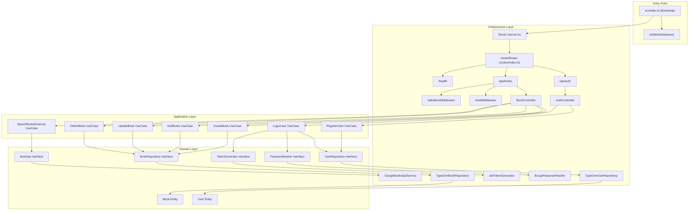
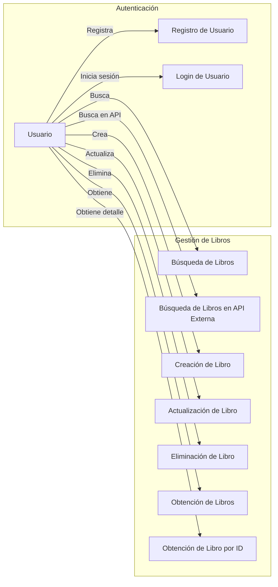
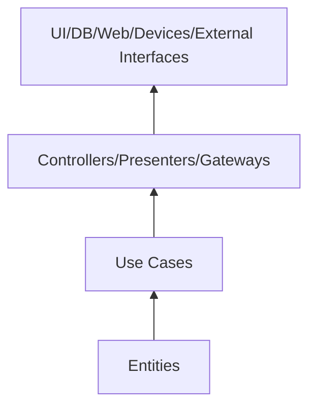

# Sistema de Gestión de Libros - Demo de Arquitectura Limpia

Este proyecto es una demostración técnica de arquitectura limpia (Clean Architecture) aplicada a una API REST de gestión de libros utilizando Node.js, TypeScript, Express y PostgreSQL con TypeORM.

## Características

- Arquitectura limpia (Clean Architecture)
- TypeScript para tipado estático
- Express para la API REST
- TypeORM como ORM para PostgreSQL
- Autenticación con JWT
- Integración con API externa (Google Books API)
- Operaciones CRUD completas
- Validación de datos
- Seguridad con Helmet y CORS
- Pruebas unitarias, de integración y e2e con Jest

## Estructura del Proyecto

```
src/
├── domain/
│   ├── entities/
│   └── repositories/
├── application/
│   ├── dtos/
│   ├── mappers/
│   ├── services/
│   └── usecases/
├── config/
│   ├── database.ts
│   └── env.ts
├── infrastructure/
│   ├── server.ts
│   ├── controllers/
│   ├── datasources/
│   │   └── typeorm/
│   │       ├── models/
│   │       ├── mappers/
│   │       └── repositories/
│   ├── external-services/
│   ├── middlewares/
│   ├── routes/
│   └── services/
└── index.ts

tests/
├── application/
│   ├── mappers/
│   └── usecases/
├── infrastructure/
│   └── services/
└── setup.ts
```

## Diagrama de Arquitectura



## Diagrama de Casos de Uso



## Instalación y Configuración

### Prerequisitos

- Node.js (v14 o superior)
- PostgreSQL
- npm o yarn

### Configuración de Variables de Entorno

Crear archivo `.env` en raíz con:

```
POSTGRES_HOST=localhost
POSTGRES_PORT=5432
POSTGRES_USER=postgres
POSTGRES_PASSWORD=postgres
POSTGRES_DB=book_management

PORT=3000
NODE_ENV=development

JWT_SECRET=tu_jwt_secret_key
JWT_EXPIRES_IN=1h

GOOGLE_BOOKS_API_KEY=tu_google_books_api_key
```

Para pruebas en `.env.test`:

```
POSTGRES_HOST=localhost
POSTGRES_PORT=5432
POSTGRES_USER=postgres_test
POSTGRES_PASSWORD=postgres_test
POSTGRES_DB=book_management_test

PORT=3001
NODE_ENV=test

JWT_SECRET=test_jwt_secret_key
JWT_EXPIRES_IN=1h

GOOGLE_BOOKS_API_KEY=test_google_books_api_key
```

### Instalación de Dependencias

```bash
npm install
```

### Scripts npm

| Comando              | Descripción                                    |
| -------------------- | ---------------------------------------------- |
| npm run dev          | Iniciar servidor en modo desarrollo             |
| npm run build        | Compilar TypeScript                            |
| npm start            | Iniciar servidor desde `dist/index.js`         |
| npm test             | Ejecutar todas las pruebas                     |
| npm run test:watch   | Ejecutar pruebas en modo watch                 |
| npm run test:coverage| Generar cobertura de pruebas                   |
```

```json
// package.json extract
"scripts": {
  "start": "node dist/index.js",
  "dev": "nodemon --exec ts-node src/index.ts",
  "build": "tsc",
  "test": "jest",
  "test:watch": "jest --watch",
  "test:coverage": "jest --coverage"
},
"dependencies": {
  "express": "^4.18.2",
  "typeorm": "^0.3.17",
  "pg": "^8.11.3",
  "reflect-metadata": "^0.1.13",
  "dotenv": "^16.3.1",
  "cors": "^2.8.5",
  "helmet": "^7.1.0",
  "morgan": "^1.10.0",
  "bcrypt": "^5.1.1",
  "jsonwebtoken": "^9.0.2",
  "axios": "^1.6.2",
  "uuid": "^11.1.0"
},
"devDependencies": {
  "typescript": "^5.3.3",
  "ts-node": "^10.9.2",
  "ts-jest": "^29.1.1",
  "jest": "^29.7.0",
  "@types/jest": "^29.5.11",
  "@types/node": "^20.10.4",
  "nodemon": "^3.0.2",
  "supertest": "^6.3.3",
  "@types/supertest": "^6.0.2",
  "testcontainers": "^10.6.0",
  "mockdate": "^3.0.5"
}
```

## Ejecutar la Aplicación

```bash
npm run dev
```

## Ejecutar Pruebas

El proyecto incluye pruebas unitarias, de integración y end-to-end (e2e):

```bash
# Ejecutar todas las pruebas
npm test

# Ejecutar pruebas en modo watch
npm run test:watch

# Generar informe de cobertura
npm run test:coverage
```

Las pruebas están estructuradas según la arquitectura:
- **Pruebas Unitarias**: Verifican componentes individuales (casos de uso, servicios).
- **Pruebas de Integración**: Verifican la interacción entre componentes (controladores, repositorios).
- **Pruebas E2E**: Verifican el flujo completo de la aplicación desde la API.

## API Endpoints

### Autenticación

- **POST /api/auth/register** - Registrar un nuevo usuario
- **POST /api/auth/login** - Iniciar sesión

### Libros

- **GET /api/books** - Obtener todos los libros
- **GET /api/books/:id** - Obtener un libro por ID
- **POST /api/books** - Crear un nuevo libro (requiere autenticación)
- **PUT /api/books/:id** - Actualizar un libro (requiere autenticación)
- **DELETE /api/books/:id** - Eliminar un libro (requiere autenticación)
- **GET /api/books/user/books** - Obtener libros del usuario autenticado (requiere autenticación)

### Búsqueda Externa

- **GET /api/books/search?q=query** - Buscar libros en Google Books API
- **GET /api/books/external/:id** - Obtener un libro de Google Books API por ID

## Principios de Clean Architecture implementados

Este proyecto sigue los principios de Clean Architecture, que incluyen:

1. **Independencia de frameworks**: El dominio no depende de ningún framework externo.
2. **Testeabilidad**: Los componentes son fácilmente testables en aislamiento.
3. **Independencia de la UI**: La lógica de negocio es independiente de la interfaz de usuario.
4. **Independencia de base de datos**: Las entidades y reglas de negocio son independientes de la persistencia.
5. **Independencia de agentes externos**: El núcleo no depende de servicios externos.

### Mejoras recientes en la arquitectura

Se han realizado mejoras para reforzar los principios de Clean Architecture:

- Eliminación de la capa de modelos redundante, utilizando directamente las entidades del dominio.
- Creación de una capa separada para DTOs (Data Transfer Objects) que facilita la comunicación entre capas.
- Mayor separación entre la representación del dominio (entidades) y los objetos de transferencia de datos (DTOs).
- Simplificación de las dependencias, promoviendo un diseño más coherente y mantenible.

#### Estructura actual de Entidades y DTOs

En la nueva estructura:

- **Entidades**: Representan objetos fundamentales del dominio con todas sus propiedades y comportamientos. Son la base del modelo de dominio y contienen las reglas de negocio fundamentales.
  - `User`: Entidad que representa un usuario en el sistema.
  - `Book`: Entidad que representa un libro en el sistema.

- **DTOs (Data Transfer Objects)**: Objetos simples utilizados para transferir datos entre procesos o capas, especialmente útiles para definir contratos de API.
  - `UserDto`: Representación simplificada de un usuario para respuestas de API.
  - `UserRegisterDto`: Datos necesarios para registrar un usuario.
  - `UserLoginDto`: Datos necesarios para iniciar sesión.
  - `UserWithToken`: Usuario con token JWT para autenticación.
  - `BookDto`: Representación simplificada de un libro para respuestas de API.
  - `CreateBookDto`: Datos necesarios para crear un libro.
  - `UpdateBookDto`: Datos para actualizar un libro existente.

Esta separación proporciona una mayor claridad en las responsabilidades y mejora la capacidad de evolucionar la API y el modelo de dominio de manera independiente.

### Separación clara entre dominio e infraestructura

La arquitectura ha sido estructurada para proporcionar una clara separación:

- Las entidades de dominio son interfaces puras sin anotaciones ni dependencias de frameworks
- Los DTOs (Data Transfer Objects) separan las representaciones internas (entidades) de los datos que se envían/reciben a través de las interfaces de la aplicación
- Las implementaciones concretas (como entidades TypeORM) están en la capa de infraestructura
- Los repositorios del dominio son interfaces, y las implementaciones concretas están en infraestructura
- Las reglas de negocio están contenidas en los casos de uso, que trabajan con abstracciones

## Principios y Prácticas de Testing

El proyecto sigue estas mejores prácticas para pruebas:

1. **Aislamiento**: Cada prueba es independiente y no afecta a otras.
2. **Mocking**: Uso de mocks para emular dependencias externas.
3. **Estructura por Capas**: Pruebas organizadas siguiendo la estructura de capas de la arquitectura.
4. **Cobertura**: Énfasis en cubrir casos de uso críticos y caminos de código importantes.
5. **Automatización**: Pruebas diseñadas para ejecutarse de manera automática en CI/CD.

## Reglas de Dependencia



## Licencia

Este proyecto está licenciado bajo la licencia ISC. 