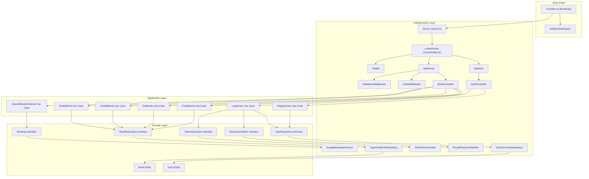
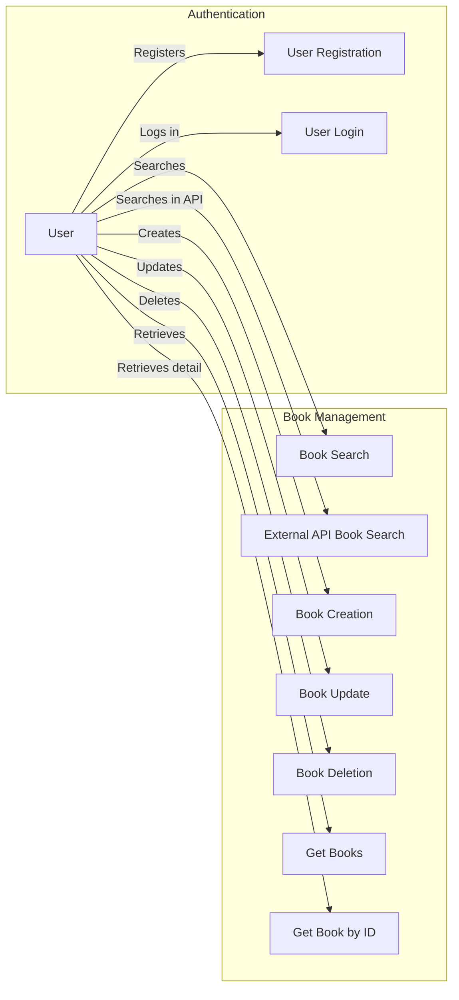
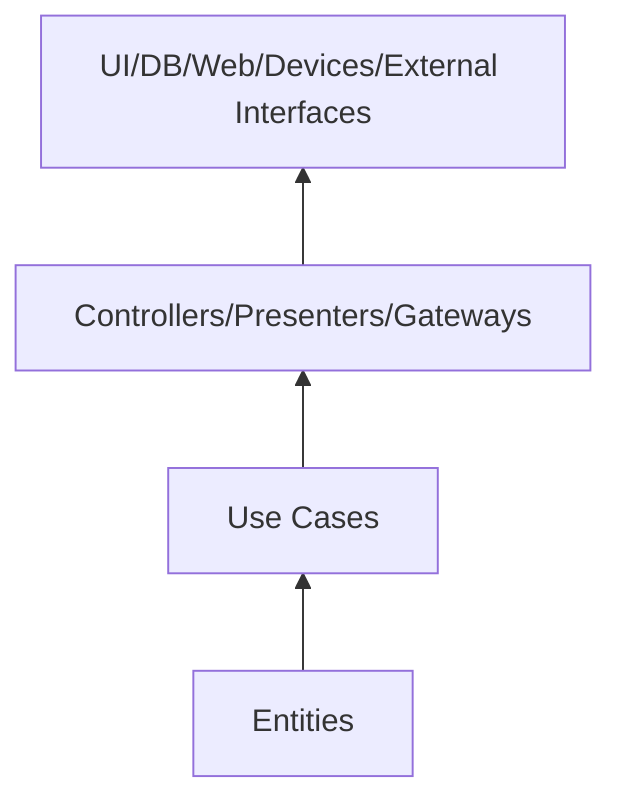

# Book Management System – Clean Architecture Demo

This project is a technical demonstration of Clean Architecture applied to a REST API for book management using Node.js, TypeScript, Express, and PostgreSQL with TypeORM.

## Features

- Clean Architecture
- TypeScript for static typing
- Express for the REST API
- TypeORM as ORM for PostgreSQL
- JWT authentication
- Integration with an external API (Google Books API)
- Full CRUD operations
- Data validation
- Security with Helmet and CORS
- Unit, integration, and end-to-end (e2e) tests with Jest

## Project Structure

```
src/
├── domain/
│   ├── entities/
│   └── repositories/
├── application/
│   ├── dtos/
│   ├── mappers/
│   ├── services/
│   └── usecases/
├── config/
│   ├── database.ts
│   └── env.ts
├── infrastructure/
│   ├── server.ts
│   ├── controllers/
│   ├── datasources/
│   │   └── typeorm/
│   │       ├── models/
│   │       ├── mappers/
│   │       └── repositories/
│   ├── external-services/
│   ├── middlewares/
│   ├── routes/
│   └── services/
└── index.ts

tests/
├── application/
│   ├── mappers/
│   └── usecases/
├── infrastructure/
│   └── services/
└── setup.ts
```

## Architecture Diagram



## Use Case Diagram



## Installation and Setup

### Prerequisites

- Node.js (v14 or higher)  
- PostgreSQL  
- npm or yarn  

### Environment Variables

Create a file named `.env` in the project root with:

```
POSTGRES_HOST=localhost
POSTGRES_PORT=5432
POSTGRES_USER=postgres
POSTGRES_PASSWORD=postgres
POSTGRES_DB=book_management

PORT=3000
NODE_ENV=development

JWT_SECRET=your_jwt_secret_key
JWT_EXPIRES_IN=1h

GOOGLE_BOOKS_API_KEY=your_google_books_api_key
```

For testing, create a `.env.test` with:

```
POSTGRES_HOST=localhost
POSTGRES_PORT=5432
POSTGRES_USER=postgres_test
POSTGRES_PASSWORD=postgres_test
POSTGRES_DB=book_management_test

PORT=3001
NODE_ENV=test

JWT_SECRET=test_jwt_secret_key
JWT_EXPIRES_IN=1h

GOOGLE_BOOKS_API_KEY=test_google_books_api_key
```

### Installing Dependencies

```bash
npm install
```

### npm Scripts

| Command               | Description                                      |
| --------------------- | ------------------------------------------------ |
| `npm run dev`         | Start server in development mode                 |
| `npm run build`       | Compile TypeScript                               |
| `npm start`           | Run server from `dist/index.js`                  |
| `npm test`            | Run all tests                                    |
| `npm run test:watch`  | Run tests in watch mode                          |
| `npm run test:coverage` | Generate test coverage report                  |

## Running the Application

```bash
npm run dev
```

## Running Tests

This project includes unit, integration, and end-to-end (e2e) tests:

```bash
# Run all tests
npm test

# Run tests in watch mode
npm run test:watch

# Generate coverage report
npm run test:coverage
```

Tests are organized according to the project’s layers:
- **Unit Tests**: Verify individual components (use cases, services).  
- **Integration Tests**: Verify interaction between components (controllers, repositories).  
- **E2E Tests**: Verify the full application flow through the API.

## API Endpoints

### Authentication

- **POST /api/auth/register** – Register a new user  
- **POST /api/auth/login** – Log in  

### Books

- **GET /api/books** – Get all books  
- **GET /api/books/:id** – Get a book by ID  
- **POST /api/books** – Create a new book (requires authentication)  
- **PUT /api/books/:id** – Update a book (requires authentication)  
- **DELETE /api/books/:id** – Delete a book (requires authentication)  
- **GET /api/books/user/books** – Get books belonging to the authenticated user (requires authentication)  

### External Search

- **GET /api/books/search?q=query** – Search books via Google Books API  
- **GET /api/books/external/:id** – Get a book from Google Books API by ID  

## Principles of Clean Architecture Implemented

This project follows Clean Architecture principles:

1. **Framework Independence**: The domain layer does not depend on any external frameworks.  
2. **Testability**: Components are easily testable in isolation.  
3. **UI Independence**: Business logic is independent of the user interface.  
4. **Database Independence**: Entities and business rules are independent of persistence.  
5. **External Agency Independence**: Core logic does not depend on external services.  

### Recent Improvements in the Architecture

- Removed redundant models layer by using domain entities directly.  
- Added a separate layer for DTOs (Data Transfer Objects) to facilitate inter-layer communication.  
- Increased separation between domain representation (entities) and data transfer objects (DTOs).  
- Simplified dependencies for a more coherent and maintainable design.  

#### Current Structure of Entities and DTOs

- **Entities** represent core domain objects with all properties and behaviors. They contain fundamental business rules.  
  - `User`: Represents a user in the system.  
  - `Book`: Represents a book in the system.  
- **DTOs** are simple objects for transferring data between processes or layers, defining API contracts.  
  - `UserDto`: Simplified representation of a user for API responses.  
  - `UserRegisterDto`: Data required to register a user.  
  - `UserLoginDto`: Data required to log in.  
  - `UserWithToken`: User data with JWT token for authentication.  
  - `BookDto`: Simplified representation of a book for API responses.  
  - `CreateBookDto`: Data required to create a book.  
  - `UpdateBookDto`: Data required to update an existing book.  

This separation clarifies responsibilities and allows the API and domain model to evolve independently.

### Clear Separation Between Domain and Infrastructure

- Domain entities are pure interfaces without framework annotations or dependencies.  
- DTOs separate internal representation (entities) from objects sent/received via application interfaces.  
- Concrete implementations (e.g., TypeORM entities) live in the infrastructure layer.  
- Domain repositories are interfaces; their implementations reside in infrastructure.  
- Business rules live in use cases, which depend only on abstractions.  

## Dependency Rules



## License

This project is licensed under the ISC License.  